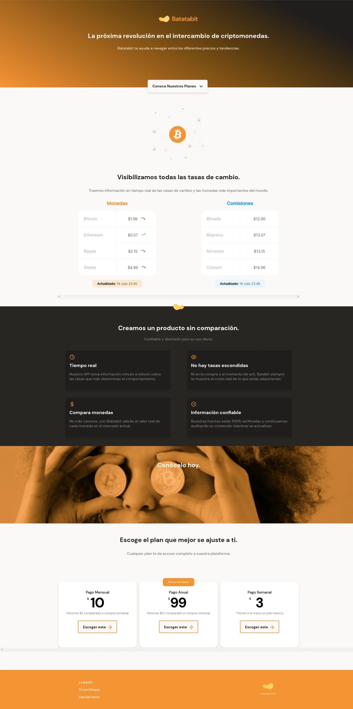

# Frontend Project - batatabit web cryptocurrencies

Responsive Design Course Project: Mobile First Layout

## Table of contents

- [Overview](#overview)
  - [Screenshots](#screenshots)
  - [Links](#links)
- [My process](#my-process)
  - [Built with](#built-with)
  - [What I learned](#what-i-learned)
  - [Continued development](#continued-development)
- [Author](#author)

## Overview

In this project I reaffirmed the best practices in the development of a professional project, good accessibility, use of light resources, adaptability of elements and use of styles according to a real web design.

### Screenshots

### Links

- Solution URL: [Click aquí](https://github.com/ronitzdev/bata-bit)
- Live Site URL: [Click aquí](https://batatabit-ronitzdev.netlify.app/)

## My process

### Built with

- Semantic HTML5 markup
- CSS custom properties
- Flexbox
- Mobile to desktop workflow
- Media queries

### What I learned

### Continued development

I will be improving the color contrast and performance improvement part of my projects.

## Author

- Website GitHub - [ronitzdev](https://github.com/ronitzdev)
- LinkedIn - [@ronitzdev](https://www.linkedin.com/in/ronitzdev/)
